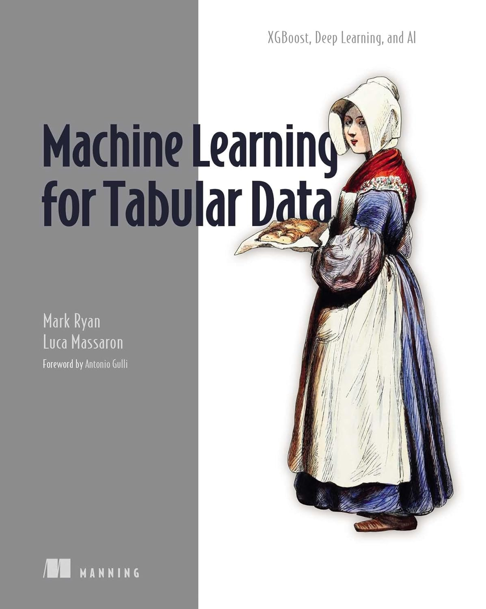

# Machine Learning for Tabular Data 
## XGBoost, Deep Learning, and AI
 

[Mark Ryan](https://www.linkedin.com/in/mark-ryan-31826743/) and [Luca Massaron](https://www.linkedin.com/in/lmassaron/) 
<EM>Foreword by Antonio Gulli</EM> 
MEAP began August 2023  Publication in February 2025 
ISBN 9781633438545  504 pages printed in black & white  

<table style="width: 100%; table-layout: fixed;">
  <tr>
    <td style="border: none; padding: 10px; vertical-align: top; width: 50%;">
      
<b>Running code directly on Google Colab:</b>

      
 

      
        
      
        
      
        
      
        
      
        
      
    </td>
    <td style="border: none; padding: 10px; text-align: center; width: 50%;">
      
    </td>
  </tr>
</table>

The book is available here: [http://mng.bz/jPlP](http://mng.bz/KeP0)
 
<B>!!! To celebrate the release of your book, we would like to offer you a launch discount code PBryan2, valid through February 19, which offers your network and contacts 45% off your book in all formats !!!</B>

<B>Business runs on tabular data in databases, spreadsheets, and logs. Crunch that data using deep learning, gradient boosting, and other machine learning techniques.</B>

<EM>Machine Learning for Tabular Data</EM> teaches you to train insightful machine learning models on common tabular business data sources such as spreadsheets, databases, and logs. You’ll discover how to use <B>XGBoost</B> and <B>LightGBM</B> on tabular data, optimize deep learning libraries like <B>TensorFlow</B> and <B>PyTorch</B> for tabular data, and use cloud tools like <B>Vertex AI</B> to create an automated MLOps pipeline.

<EM>Machine Learning for Tabular Data</EM> will teach you how to:

* Master XGBoost
* Apply deep learning to tabular data
* Deploy models locally and in the cloud
* Pipelines to train and maintain your models

**About the book**

Machine learning can accelerate everyday business chores like account reconciliation, demand forecasting, and customer service automation—not to mention more exotic challenges like fraud detection, predictive maintenance, and personalized marketing. This book shows you how to unlock the vital information stored in spreadsheets, ledgers, databases, and other tabular data sources using gradient boosting, deep learning, and generative AI.

**About the reader**

For readers experienced with Python and the basics of machine learning.

**About the authors**

<B>Mark Ryan</B> is the AI Lead of the Developer Knowledge Platform at Google and has extensive experience in relational databases and applications of AI. 
<B>Luca Massaron</B> is a 3-time Kaggle Grandmaster with over a decade of data science experience and a Google Developer Expert (GDE) in machine learning.
